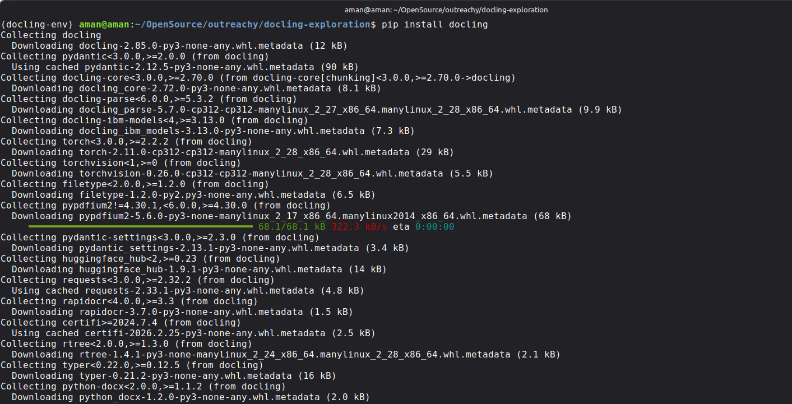
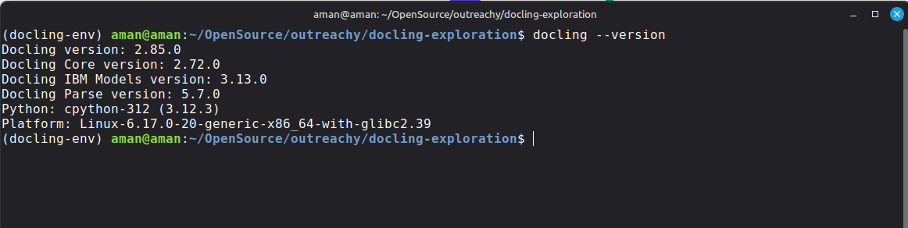
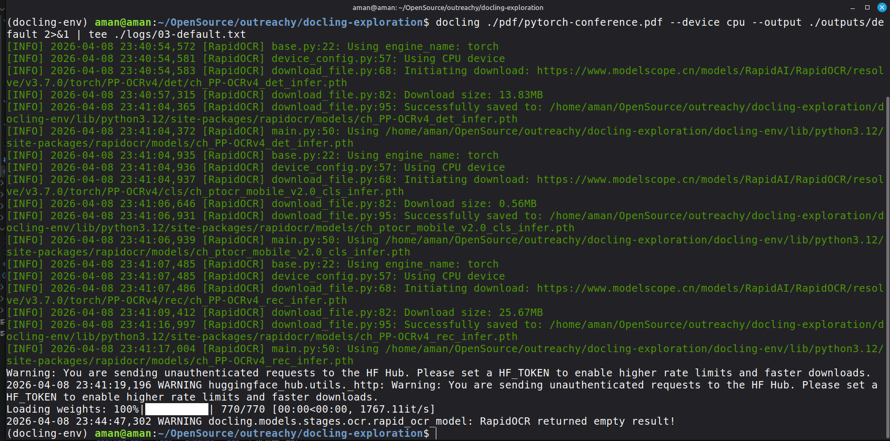
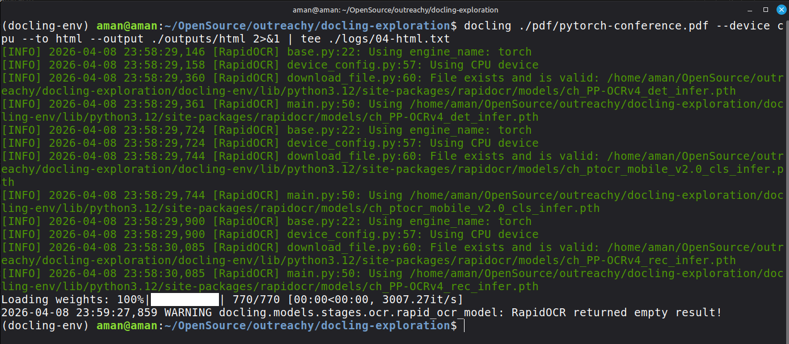

# Outreachy 2026 - Issue #122

## Docling: Explore Document Processing Basics

This repository documents my hands-on exploration for:
- [Outreachy 2026] Docling: explore document processing basics (#122)

Goal: use Docling CLI to convert a PDF to multiple formats, try additional options, and compare outcomes for RAG-style preprocessing.

## Environment Setup

### 1) Create and activate virtual environment

```bash
python3 -m venv docling-env
source docling-env/bin/activate
```

### 2) Install Docling

```bash
pip install docling
```

Installation completed successfully with dependencies including `torch`, `torchvision`, `rapidocr`, and others.



### 3) Verify installed version

```bash
docling --version
```

Observed output:

```text
Docling version: 2.85.0
Docling Core version: 2.72.0
Docling IBM Models version: 3.13.0
Docling Parse version: 5.7.0
Python: cpython-312 (3.12.3)
Platform: Linux-6.17.0-20-generic-x86_64-with-glibc2.39
```



### 4) Check CLI options

```bash
docling --help
```

Relevant options used in this exploration:
- `--to [md|html|json|...]`
- `--device [auto|cpu|cuda|...]`
- `--no-ocr`
- `--table-mode [fast|accurate]`
- `--output PATH`

## Input Document

I used a brochure-style PDF with mixed layout content:

- `pdf/pytorch-conference.pdf`

Reason for selection:
- Multi-section layout
- Visual elements
- Better for testing parser behavior than plain text-only documents

## Experiments

All commands were run from project root:
- `/home/aman/OpenSource/outreachy/docling-exploration`

Logs were captured with `tee` into `logs/`.

---

### Experiment 1 - Default conversion (Markdown)

Command:

```bash
docling ./pdf/pytorch-conference.pdf --device cpu --output ./outputs/default 2>&1 | tee ./logs/03-default.txt
```

Primary observations from log:
- RapidOCR used CPU device.
- First run downloaded OCR model artifacts.
- Warning shown about unauthenticated HF hub requests.
- Final warning: `RapidOCR returned empty result!`

Generated output:
- `outputs/default/pytorch-conference.md`

Evidence:
- `logs/03-default.txt`

Timing note (from log timestamps):
- Approx. 3m53s (`23:40:54` to `23:44:47`), including first-time model download.

Screenshots:
- Terminal output: `screenshots/03-default-terminal.png`
- Markdown output (`pytorch-conference.md`): `screenshots/04-default-markdown-output.png`




---

### Experiment 2 - HTML conversion

Command:

```bash
docling ./pdf/pytorch-conference.pdf --device cpu --to html --output ./outputs/html 2>&1 | tee ./logs/04-html.txt
```

Primary observations from log:
- OCR model files were reused (`File exists and is valid`).
- CPU device used.
- Final warning: `RapidOCR returned empty result!`

Generated output:
- `outputs/html/pytorch-conference.html`

Evidence:
- `logs/04-html.txt`

Timing note (from log timestamps):
- Approx. 58s (`23:58:29` to `23:59:27`).

Screenshots:
- Terminal output: `screenshots/05-html-terminal.png`
- HTML output preview: `screenshots/06-html-output.png`




---

### Experiment 3 - Disable OCR

Command:

```bash
docling ./pdf/pytorch-conference.pdf --device cpu --no-ocr --output ./outputs/no-ocr 2>&1 | tee ./logs/05-no-ocr.txt
```

Primary observations from log:
- Run completed successfully.
- Log mainly shows model weight loading progress.
- No `RapidOCR returned empty result!` warning in this run.

Generated output:
- `outputs/no-ocr/pytorch-conference.md`

Evidence:
- `logs/05-no-ocr.txt`

TODO:
- Add terminal screenshot
- Compare text quality side-by-side with default markdown

---

### Experiment 4 - Table mode fast

Command:

```bash
docling ./pdf/pytorch-conference.pdf --device cpu --table-mode fast --output ./outputs/table-fast 2>&1 | tee ./logs/06-table-fast.txt
```

Primary observations from log:
- CPU device used.
- OCR files reused from cache.
- Final warning: `RapidOCR returned empty result!`

Generated output:
- `outputs/table-fast/pytorch-conference.md`

Evidence:
- `logs/06-table-fast.txt`

Timing note (from log timestamps):
- Approx. 1m05s (`00:05:02` to `00:06:07`).

TODO:
- Add terminal screenshot
- Highlight one table region from output for comparison

---

### Experiment 5 - Table mode accurate

Command:

```bash
docling ./pdf/pytorch-conference.pdf --device cpu --table-mode accurate --output ./outputs/table-accurate 2>&1 | tee ./logs/06-table-accurate.txt
```

Primary observations from log:
- CPU device used.
- OCR files reused from cache.
- Final warning: `RapidOCR returned empty result!`

Generated output:
- `outputs/table-accurate/pytorch-conference.md`

Evidence:
- `logs/06-table-accurate.txt`

Timing note (from log timestamps):
- Approx. 54s (`00:17:57` to `00:18:51`).

TODO:
- Add terminal screenshot
- Highlight one table region from output for comparison

## Comparative Analysis

### Default Markdown vs HTML
- Markdown is simpler and easier for text-based downstream processing.
- HTML preserves presentational structure better for visual review.
- In this dataset, parse-time dominated conversion; output format itself did not cause a large runtime jump after caching.

### OCR enabled (default) vs `--no-ocr`
- For this PDF, disabling OCR still produced usable output.
- Repeated warning `RapidOCR returned empty result!` in OCR-enabled runs suggests OCR often found little/no extra text in image regions for this file.
- For scanned documents, OCR is still expected to be important.

### `--table-mode fast` vs `--table-mode accurate`
- In my run logs, `accurate` was not slower than `fast` (54s vs 65s).
- This can happen due to run-to-run variance and cache effects.
- Quality comparison will be finalized with screenshot/table snippets.

## Notes on CPU/GPU

I explicitly used:

```bash
--device cpu
```

This keeps runs deterministic on my laptop and avoids CUDA/driver mismatch issues seen in environment checks.

## Current Output Artifacts

### Logs
- `logs/03-default.txt`
- `logs/04-html.txt`
- `logs/05-no-ocr.txt`
- `logs/06-table-fast.txt`
- `logs/06-table-accurate.txt`

### Converted files
- `outputs/default/pytorch-conference.md`
- `outputs/html/pytorch-conference.html`
- `outputs/no-ocr/pytorch-conference.md`
- `outputs/table-fast/pytorch-conference.md`
- `outputs/table-accurate/pytorch-conference.md`

## Pending Additions

I will add these next:
- Screenshots for each command/output
- Additional format tests:
  - `--to json`
  - `--to text` (optional)
- Optional visualization/debug run:
  - `--show-layout`
- Final side-by-side snippets showing table extraction differences

## Command Summary

```bash
# Version and help
docling --version
docling --help

# Default markdown
docling ./pdf/pytorch-conference.pdf --device cpu --output ./outputs/default 2>&1 | tee ./logs/03-default.txt

# HTML
docling ./pdf/pytorch-conference.pdf --device cpu --to html --output ./outputs/html 2>&1 | tee ./logs/04-html.txt

# No OCR
docling ./pdf/pytorch-conference.pdf --device cpu --no-ocr --output ./outputs/no-ocr 2>&1 | tee ./logs/05-no-ocr.txt

# Table mode fast
docling ./pdf/pytorch-conference.pdf --device cpu --table-mode fast --output ./outputs/table-fast 2>&1 | tee ./logs/06-table-fast.txt

# Table mode accurate
docling ./pdf/pytorch-conference.pdf --device cpu --table-mode accurate --output ./outputs/table-accurate 2>&1 | tee ./logs/06-table-accurate.txt
```
